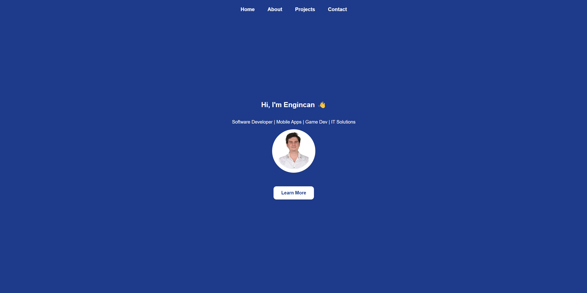
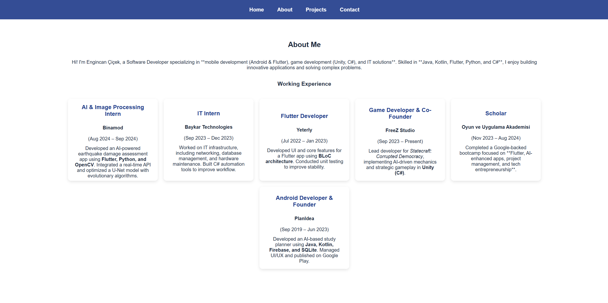
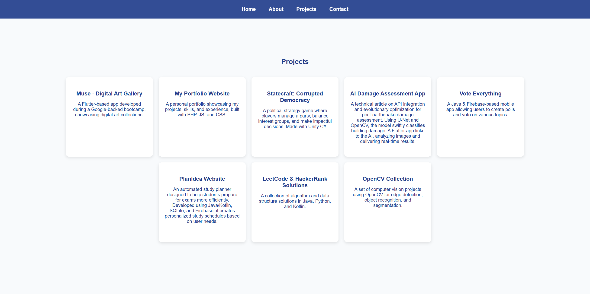
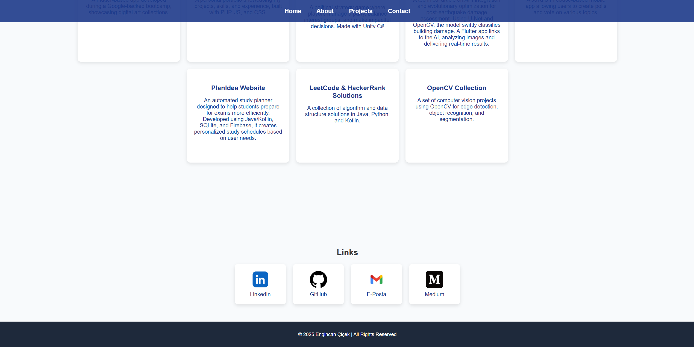

# Portfolio Website

This project is a **personal portfolio website** for me, showcasing my software development experience, projects, and skills. The website is built using **PHP, HTML, CSS, and JavaScript** and is hosted on a **CPANEL and LINUX HOST**.

---

## 📸 Screenshots

### 🏠 Landing Page (Hero Section)

### 👤 About Page

### 🛠️ Projects Page

### 📞 Contact Page

---

## 📂 File Structure & Descriptions

### 1️⃣ **index.php**
   - The **main landing page** of the website.
   - Features a **hero section** welcoming visitors.
   - Contains links to **Projects, About, and Contact** pages.

### 2️⃣ **about.php**
   - The **About Me** page.
   - Provides details about Engincan Çiçek’s background, skills, and work experience.

### 3️⃣ **projects.php**
   - A page listing **Engincan Çiçek’s projects**.
   - Displays **project titles, descriptions, and links**.

### 4️⃣ **contact.php**
   - Contains a **contact form** allowing visitors to reach out.
   - Includes fields for **name, email, and message**.

### 5️⃣ **header.php**
   - The **navigation bar (navbar)** used across all pages.
   - Manages menu links dynamically.

### 6️⃣ **footer.php**
   - The **footer section** shared across all pages.
   - Contains copyright information and additional links.

### 7️⃣ **style.css**
   - The **stylesheet** defining the visual layout of the website.
   - Includes **responsive design rules** for mobile compatibility.
   - Styles elements such as **navbar, buttons, cards, and footer**.

### 8️⃣ **script.js**
   - Handles **JavaScript functionality** for the website.
   - Implements **smooth scrolling** for navbar links.

---

## 🚀 Technologies Used
- **PHP** – Dynamic content management on the server side
- **HTML5** – Structuring web pages
- **CSS3** – Styling and responsive design
- **JavaScript (Vanilla JS)** – Dynamic interactions and animations
- **Linux Hosting (CPanel)** – Hosting the website on a live server
